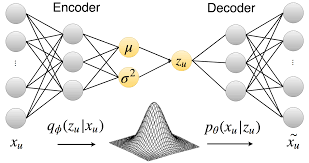

VAE_recommender_system
======================

**e-commerce VAE Recomender system example**

Contents
--------

1.	[Introduction](#introduction)
2.	[Dataset](#dataset)
3.	[Results](#results)

### Introduction

---

-	e-commerce 플랫폼의 쇼핑 구매 이력 데이터셋을 활용해, VAE(Variational Auto-Encoder) 기반 Collaborative Filtering Recommender system을 구현합니다.<br/><br/>

-	VAE(Variational Auto-Encoder)는 input dimension과 output dimension이 동일한 Autoencoder의 스트럭쳐를 가지고 있습니다.</br>

-	주어진 X로부터 latent variable z를 샘플링해오는 확률분포 q_phi(z|x)를 통제하기 쉬운 Normal Distribution에 근사하도록 학습시켜(Variational Inference) z로부터 원하는 x값을 reconstruction 할 수 있도록 의도한 생성 모델입니다.</br>

-	Collaborative Filtering에서는 sparse한 user-item interaction을 completion하기 위해 작은 latent space로 dimensionality reduction을 수행한 뒤 재복원하는 방식으로 고객의 rating/interaction을 예측합니다.

</br>

-	VAE 알고리즘의 성능 비교 관련 아티클:

https://medium.com/snipfeed/how-variational-autoencoders-make-classical-recommender-systems-obsolete-4df8bae51546

**How Variational Autoencoders make classical recommender systems obsolete. - by Quentin Bacuet**

<br/>

<p align="center">


### Dataset

---

다음의 링크를 통해 다운받을 수 있습니다.

```bash
https://www.kaggle.com/carrie1/ecommerce-data
```

이 데이터셋은 54만건의 구매 기록을 포함하고 있으며, 총 4,372명의 유저와 4,070 종의 상품으로 구성되어 있습니다.</br>

### Results

---

NDCG와 Recall을 metric으로 사용해 결과를 측정했습니다. @n은 총 n개의 상품을 추천했을 때의 NDCG와 Recall을 의미합니다.

| methods | NDCG@100 | Recall@20 | Recall@50 |
|---------|:--------:|:---------:|:---------:|
| VAE     |  0.1952  |  0.1836   |  0.2518   |
| DAE     |  0.1967  |  0.1846   |  0.2567   |

### References

대부분의 코드는 아래의 깃헙 레포지터리에서 차용했습니다.

https://github.com/dawenl/vae_cf/blob/master/VAE_ML20M_WWW2018.ipynb
